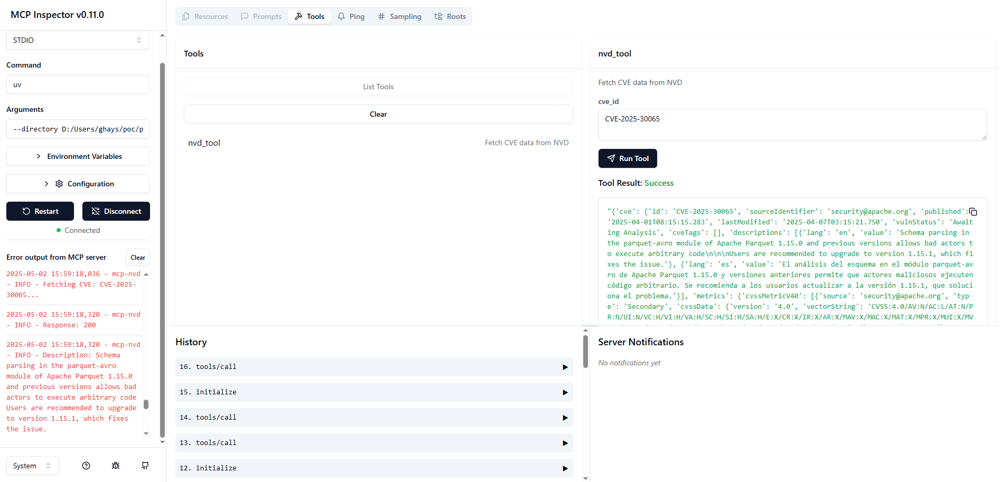

# MCP NVD Server

[](https://www.python.org/)
[](https://www.anthropic.com/news/model-context-protocol)

MCP server that retrieves CVE information from the national vulnerability database (NVD).

## Installation

### Prerequisites

Install the following.

- [uv](https://github.com/astral-sh/uv)
- [Node.js](https://nodejs.org/en)

## Building

> [!NOTE]
> This project employs `uv`.

1. Synchronize dependencies and update the lockfile.
```
uv sync
```

## Debugging

### MCP Inspector

Use [MCP Inspector](https://github.com/modelcontextprotocol/inspector).

Launch the MCP Inspector as follows:

```
npx @modelcontextprotocol/inspector uv --directory /path/to/mcp-nvd run mcp-nvd
```



## NVD Rate Limiting

### How to Add an API Key
- [Getting Started](https://nvd.nist.gov/developers/start-here)
- [Request an API Key](https://nvd.nist.gov/developers/request-an-api-key)
